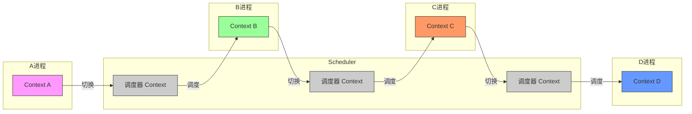

### Proj 2：进程通信，线程

> 现场验收：2026.5.8晚上18:30-20:30，实验楼103
> 报告提交截止日期：验收通过后、2026.5.10晚上23:59前

本实验用于理解进程通信和线程。目前xv6中进程通信的方式只有管道，缺少其他通信方式，在第1部分任务中，你需要完成一个简单的设计，通过内核变量在进程之间传递数据；xv6也不支持线程，在第2部分任务中，你需要完成一个用户级线程的支持，以及一个内核级线程的支持。

#### 1. 进程通信（20分）

进程之间由于地址空间隔离，无法通信，一种简单的方案如下：在内核中建立一个整型变量`ucounter`，用户进程通过系统调用访问这个整型变量。

  具体而言，实现以下系统调用

  ```c
  int ucounter_get()
  ```

  获取`ucounter`的值。

  系统调用

  ```c
  void ucounter_set(int)
  ```

  用于设置`ucounter`的值。

  实现后，运行测试命令`testcounter`，得到的输出如下

  ```bash
  $ testcounter
  Child: set counter to 5
  Parent: the value of counter is 5
  ```


##### commit消息要求

完成本部分实验时，必须提交commit，消息的内容是：`1. Process Communication Done`


#### 2. 用户级线程（20分）

> 可以被替代，可以实现其他用户级线程库，支持完成uthread_test测试，输出不需要和下文完全一致，但线程之间有一定的轮流，每个线程输出5次。

本部分你需要完成用户级线程支持。目前已完成大部分，你需要完成剩下的部分。本部分线程实现模仿了xv6中进程的管理方式。

线程相关的数据结构包括两部分，定义在uthread.h中，如下

```c
struct context{
    uint edi;
    uint esi;
    uint ebx;
    uint ebp;
    uint eip;
};

struct uthread{
    char stack[STACK_SIZE];
    struct context *context;
    int state;
    int uid;
};
```

其中，context为线程执行的上下文结构体，与内核中的同名变量一致。uthread为线程管理的结构体，为了方便起见，只保留了栈stack、上下文的地址context、以及状态state和编号uid。注意，这里的栈是数组，不是地址，所以不用malloc动态分配；context是地址变量，地址指向栈中，含义与proc结构体中的context地址变量一致（变量存储的值是esp寄存器的值）。

uthread.c中定义了线程的三个接口函数，这些函数已经完成了一部分，你需要根据注释完成剩余的部分。

```c
void uthread_create(void (*func)(void))
    /*该函数创建了一个用户线程，状态为就绪，需要执行的函数为func，等待被调度，。*/
    
void uthread_yield()
  /*调用此函数的线程将变为就绪态，同时，调用调度器。*/
    
void uthread_exit()
  /*调用此函数的线程将归还thread结构体，同时，调用调度器*/
```


此外，定义了线程调度函数

```c
void uthread_schedule()
    /*该函数将从线程列表中搜素一个不同于当前线程的就绪线程，然后进行上下文切换，将当前执行状态保存在current_thread的context结构体中，再从下一个线程的context结构体中恢复上下文*/
```


测试用例为uthread_test，典型输出如下（有兴趣的同学，可以修改调度器，让三个线程轮流执行）

```bash
$ uthread_test
Main thread is running
Thread 1 is running
Thread 2 is running
Thread 1 is running
Thread 2 is running
Thread 1 is running
Thread 2 is running
Thread 1 is running
Thread 2 is running
Thread 1 is running
Thread 2 is running
Thread 3 is running
Thread 3 is running
Thread 3 is running
Thread 3 is running
Thread 3 is running
No available thread, exiting the whole process
```

说明：

- 本实验中线程库，在线程切换时直接从上一个线程切换到了下一个线程，即，

  ```mermaid
  flowchart LR
    subgraph A线程
      A[Context A]
    end
    subgraph B线程
      B[Context B]
    end
    subgraph C线程
      C[Context C]
    end
    subgraph D线程
      D[Context D]
    end
  
    A -->|切换| B -->|切换| C -->|切换| D
    style A fill:#f9f,stroke:#333
    style B fill:#9f9,stroke:#333
    style C fill:#f96,stroke:#333
    style D fill:#69f,stroke:#333
  ```

  并没有如xv6内核管理进程那样为调度器本身保存一个上下文，即cpu->scheduler，xv6内核中的切换次序如下（注意，每个进程中还存在内核态到用户态再到内核态的过程，图中忽略了）。




##### commit消息要求

完成本部分实验时，必须提交commit，消息的内容是：`2. User-Level Thread Done`


#### 3. 内核级线程（30分）

> 可以采取其他实现方式，以通过threadtest为准。

xv6目前不支持内核多线程，你需要修改内核以支持此功能。

任务分为两部分，一部分为库函数（已给出），一部分为系统调用（需要实现）。因为系统调用的参数较多，库函数可以对系统调用做进一步包装，简化用户的使用负担。事实上，这也是一种通用的做法，类似于glibc封装了很多系统调用，比如，printf是glibc给出的，它内部实现了用户空间的缓冲，真正输出时调用了write系统调用；malloc也是glibc提供的，内部调用了brk或者sbrk系统调用；另外，fork虽然是个系统调用，但glibc假装提供了fork调用的封装，实际上在背后调用了clone。

> 小建议：
>
> OS调试异常困难，建议在第一次编写时，在每个函数开头和结尾打印输出语句，比如，在内核中时 cprintf("entering clone with parameters %d %d %d\n", a,b,c); cprintf("leaving clone with exit code %d %d %d\n", a,b,c); 这样在出错时能快速定位到是哪个函数引起的错误，以及输入输出是否有误。有的同学会定义一个宏DEBUG，在代码中写 if(DEBUG) {打印调试信息}，最后在生成代码时将DEBUG定义为0。


##### 3.1 库函数（类似于glibc，已给出）
回忆pthread_create, pthread_exit和pthread_join的语义，xthread.c也有三个类似的函数，它们分别是：

```c
int xthread_create(int *tid, void * (*start_routine)(void *), void *arg)
```

用户进程若调用了这个API（该API主要是对clone进行封装，需要申请一块区域作为线程的栈），就会在进程内创建一个新的线程：

- 如果创建成功返回1，失败返回-1
- xv6分配给线程的ID需要保存在tid指向的内存中（即*tid等于ID值）
- 线程执行的第一个函数是start_routine，这个函数的参数类型是 void *，返回值也是void *
- arg是start_routine的输入参数
- start_routine的返回值需要保存下来，保存在什么地方需要自行设计，一般而言无非寄存器、用户栈、内核空间，简单的做法是在PCB或TCB中用一个变量保存该值。用户可以在另一个线程中使用API，xthread_join()，获得此返回值。当然，若没有线程使用xthread_join，则返回值就被丢弃了。


```c
void xthread_exit(void * ret_val_p)
```
此API是对thread_exit进行封装。调用此API的线程将会退出，退出码/返回值为ret_val_p。此这个退出码需要保存下来，其他线程通过xthread_join()可以获得这个退出码。保存在什么地方和前面一样。

也就是说，线程退出有两种方式，一种是线程执行的函数结束了，另一种是线程主动调用了xthread_exit。你在实现的过程中是需要考虑如何区分这两种方式。两种方式的返回值都需要保存。


```c
void xthread_join(int tid, void ** retval)
```
调用此API的线程会等待，直到tid线程顺利结束。tid线程的返回值被保存在retval指向的内存中，即返回值被放到*retval中。此外，本函数还应当释放用户栈（线程的用户栈是在xthread_create中申请，在本函数中释放）。


##### 3.2 系统调用
没有内核支持很难实现以上功能，所以你需要实现三个系统调用，下面是系统调用用户空间封装函数的声明。
```c
int clone(void * (*fn)(void *), void *stack, void *arg)
```
【与创建进程的fork对应。】

此系统调用在内核中创建一个新的内核级线程，此线程可以共享创建者进程的地址空间。线程创建后，将执行fn处的指令。arg是提供给fn函数的参数。线程使用stack作为用户栈，stack由xthread_create通过malloc申请，大小为4096字节，在调用clone时作为参数传入。返回值为正表示执行成功，为线程的pid；返回值为-1表示执行失败。


你可以同时参考fork( ) 和exec( )，有以下需要注意的地方。

- fork出来的新进程不共享创建者的地址空间，但clone需要共享。你可以直接使用进程的PCB而不是重新定义一种线程TCB，但你需要思考如何让多个线程共享地址空间（将创建地址空间的操作替换为指向同一张页表）。

- 新创建的线程需要执行fn处的指令，可以通过设置新线程初始状态的trapframe达到此目的（新的PCB存储上下文信息的域为tf，tf中有个域是eip，即进程陷入内核时PC寄存器的值，将来从内核态返回用户态时，该值会被iret指令弹到PC寄存器中，所以，设置eip域即可），同时，也可以参考exec。

- 如何让新线程使用stack作为用户栈？tf中有个域是esp，存储的是进程陷入内核中时栈寄存器的值，直接设置esp的值指向传入的stack可以吗？不行，你得把栈准备一下，包括压入参数，再压入一个特殊的返回地址（exec中放的特殊地址是全f，你可能需要放个其他的值，以便区分），接着再相应修改esp的值，参考exec函数。

- 注意栈是从高地址向低地址长的，而malloc返回的是内存区域的低地址；另外malloc分配的内存地址可以从任意地址开始，并不一定是页对齐的。

  > 比如传入的stack已经是高地址了，则以下代码可以准备好用户栈，并设置启动时需要执行的函数
  >
  > ```c
  > np->tf->esp=(uint)stack-4; //4个字节放参数
  > *((int *)np->tf->esp)=arg;
  > 
  > np->tf->esp-=4;//4个字节放一个返回地址，假的，注意设计个特殊的返回地址，方便异常时捕获
  > *((int *)np->tf->esp)=0xffff fffe;
  > np->tf->eip=fn; //让线程启动时执行这个函数
  > ```
- 当fn执行结束时，若它没有主动调用thread_exit，则表明fn通过return某个值的方式结束。为了获取到return的值，你可以在创建线程时预设一个假的返回地址，如0xffffffff，然后在trap中捕获page fault，进行特殊处理。函数的返回值从哪里获取？x86架构下是在eax寄存器中。

- 用filedup复制的文件描述符记得在thread_exit中用fileclose关掉。

-	关于函数调用栈的信息可以参阅 http://wiki.osdev.org/Stack


```c
void join(int tid, void ** ret_p, void ** stack)
```
【与等待子进程的系统调用wait对应】

执行此系统调用的线程将等待编号为tid的线程，直到其终止；然后将终止线程的返回值放入\*ret_p；将终止线程的用户栈放入*stack。这样xthread才能通过free函数释放终止线程的用户栈（用户栈是xthread通过malloc申请的）。可以参考wait函数的实现。


```c
void thread_exit(void *ret);
```
【与进程退出系统调用exit对应】

线程终止，传入参数ret是线程执行的函数的返回值。此函数需要唤醒通过join等待自己的线程。你可以参考exit的实现。

为简化设计，做以下约定（测试程序遵守这个约定）：

-	只有进程被创建时的线程（主线程）会执行clone，即，被clone出来的线程不会执行clone。
-	只有主线程会调用exit，它不会调用thread_exit。主线程调用exit时，需要将所有未终止的线程全部终止并释放相应内核资源（直接释放即可，类似于join中释放资源）。
-	只有主线程会调用fork，且fork不需要考虑线程。
-	在开始阶段，建议在参数传递过程中，尤其是在用户态和内核态的代码之间传递参数时，添加打印语句，先保证参数正常传递进来了。结束后再把这些语句删除。
-	记得用fileclose关掉在clone中复制的文件描述符
-	你可以在测试阶段修改threadtest.c，但是提交时一定替换为base中的原始文件。

其他部分你可以自行设计，比如PCB包含什么信息。

【此外，你还需要修改exit系统调用，释放该进程下其他线程的资源，比如PCB】


测试时请运行threadtest至少两次。第一次的预期输出为（具体输出可能稍有不同，请阅读threadtest.c文件的注释部分）：

``` sh
$ threadtest
-------------------- Test Return Value --------------------
Child thread 1: count=3
Child thread 2: count=3
Main thread: thread 1 returned 2
Main thread: thread 2 returned 3

-------------------- Test Stack Space --------------------
ptr1 - ptr2 = 16
Return value 123

-------------------- Test Thread Count --------------------
Child process created 60 threads
Parent process created 61 threads
```

之后不要关闭qemu，接着再运行一次threadtest，第二次的预期输出与第一次相同。若不同，表明释放资源部分有问题。


##### commit消息要求

完成本部分实验时，必须提交commit，消息的内容是：`3. Kernel-Level Thread  Done`


#### 4. 实验报告和代码（30分）

实验报告(即，README.md)需要包含以下要素：

- 不要包含原始题目的完整描述。
- 包含标题（和发布的题目一致）、学号、姓名
- 记录调试过程及遇到的复杂问题。（10分）
- 自行编写测试程序，对两种线程的性能进行测试，给出评估结果，需要包含性能数据对比、分析与结论。（20分）


